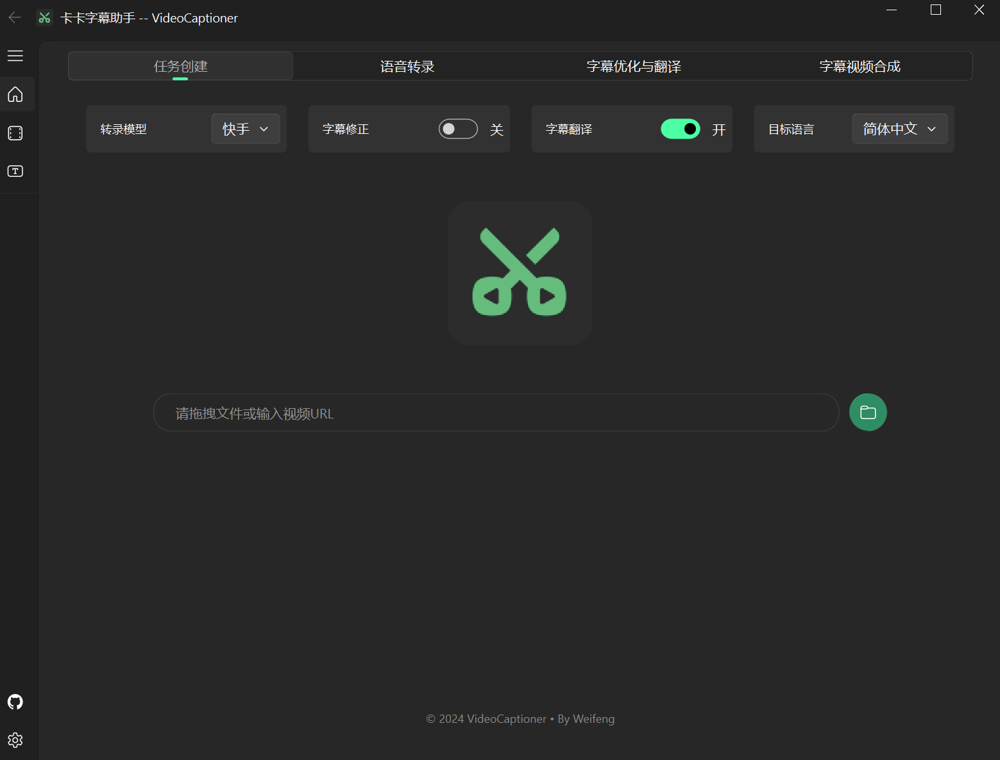
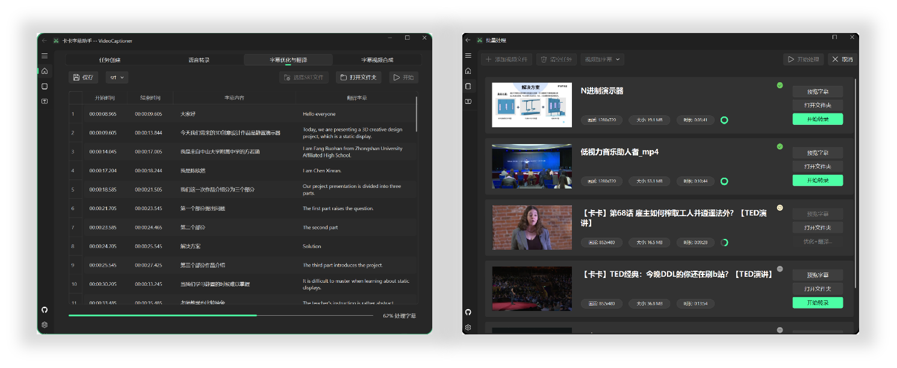
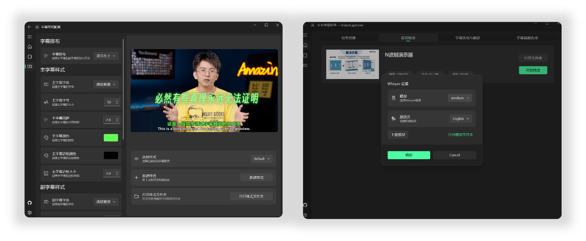

<div align="center">
  
  <h1>VideoCaptioner</h1>
  <p>一款基于大语言模型(LLM)的智能视频字幕处理助手，支持字幕生成、优化、翻译等功能</p>

  简体中文 / [English](./docs/README_EN.md)
</div>

## 📖 项目介绍

VideoCaptioner 是一款功能强大的视频字幕配制软件。操作简单且无需高配置，利用大语言模型进行字幕智能断句、校正、优化、翻译，一键为视频配上效果惊艳的字幕。

- 🎯 无需GPU即可使用强大的语音识别引擎，自动生成精准字幕
- ✂️ 基于 LLM 的智能分割与断句，字幕阅读更自然流畅
- 🔄 AI字幕优化与翻译，调整字幕格式、表达更地道专业
- 🎬 支持批量视频字幕合成，大幅提升处理效率
- 📝 直观的字幕编辑查看界面，字幕调整得心应手

## 📸 界面预览






## ✨ 主要功能

软件充分利用大语言模型(LLM)在理解上下文方面的优势,对语音识别生成的字幕进行智能校正和翻译。有效修正语音识别中的错别字,优化前后文的连贯性和名词名称的一致性,让字幕更加自然流畅,效果出众！

另外，字幕断句对观看体验影响较大，软件内置 LLM 断句优化，可有效提升句子流畅度。

### 1. 语音识别与字幕生成
- 支持在线模型（高速、免费）
- 本地 Whisper 模型（保证敏感数据安全、可离线）
- 集成 ffmpeg 环境

### 2. 字幕优化
- 智能纠正错别字
- 优化大小写、代码、公式等格式
- 基于 LLM 的智能断句优化

### 3. 字幕翻译
- 支持多语言翻译
- 上下文感知的翻译优化
- 可配置自定义 LLM API

### 4. 字幕合成
- 支持多种字幕样式
- 灵活的字幕时间轴调整
- 高质量视频导出

## 🚀 快速开始

### Windows 用户

软件较为轻量，打包大小不足 60M,已集成必要环境，下载后可直接运行。

1. 从 [Release](https://github.com/WEIFENG2333/VideoCaptioner/releases) 页面下载最新版本的可执行程序
2. 解压后直接运行 `VideoCaptioner.exe`

### MacOS 用户

由于本人缺少 Mac ，所以没法测试和打包，暂无法提供 MacOS 的可执行程序。

Mac 用户请自行使用下载源码和安装 python 依赖运行。

1. 安装 ffmpeg
```bash
brew install ffmpeg
```

2. 克隆项目
```bash
git clone https://github.com/WEIFENG2333/VideoCaptioner.git
```

3. 安装依赖
```bash
pip install -r requirements.txt
```

4. 运行程序
```bash
python main.py
```

### 基本配置

软件内置基础 LLM 模型（`gpt-4o-mini`），可无需配置正常使用，但并发量并不高，且效果并非最佳。建议在设置里面配置个人 API 以调用更强大的模型获得更好的翻译和优化准确度。

1. 可配置 LLM API
- 支持 OpenAI 接口格式，国内阿里通义千问、DeepSeek 等模型均已经支持改格式
- 使用 `gpt-4o-mini` 模型，性价比高。
- 如果追求更好的效果，可以考虑 `Claude-3.5-sonnet` 或 `gpt-4o`

2. 如需使用本地 Whisper 模型,请在软件中下载所需模型 
- 支持的本地模型：`Tiny`, `Base`, `Small`, `Medium`, `Large-v1`, `Large-v2`
- 为了保证良好的识别效果，建议使用 `Medium` 或以上模型

3. 对字幕样式设置
- 主字幕和副字幕配置：字幕字体、大小、颜色、边框颜色、边框宽度、行间距、字幕位置
- 对齐方式（原文在上、译文在上、仅原文、仅译文）

## 💡 软件流程介绍

完整的处理流程如下:
```
语音识别 -> 字幕生成 -> 字幕优化翻译(可选) -> 字幕视频合成
```

## 📝 注意事项
- 字幕断句对观看体验影响较大,建议启用 LLM 优化

## 🤝 贡献指南

欢迎提交 Issue 和 Pull Request 帮助改进项目。