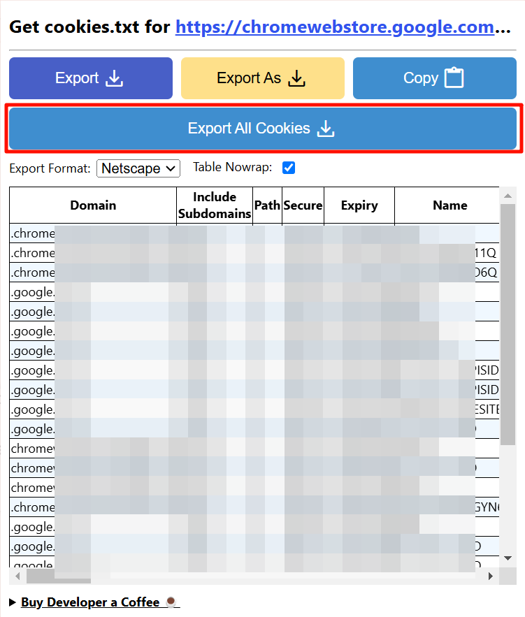

# Cookie 配置说明

## 问题说明
在使用软件下载视频时，可能会遇到以下错误提示：


这是因为:
1. 某些视频平台(如B站)需要用户登录信息才能获取高质量视频
2. 部分网站(如YouTube)在网络条件较差时需要验证用户身份

## 解决方法

### 1. 安装浏览器扩展
根据你使用的浏览器选择安装:

- Chrome浏览器: [Get CookieTxt Locally](https://chromewebstore.google.com/detail/get-cookiestxt-locally/cclelndahbckbenkjhflpdbgdldlbecc)
- Edge浏览器: [Export Cookies File](https://microsoftedge.microsoft.com/addons/detail/export-cookies-file/hbglikhfdcfhdfikmocdflffaecbnedo)

### 2. 导出Cookie文件
1. 登录需要下载视频的网站(如B站、YouTube等)
2. 点击浏览器扩展图标
3. 选择"Export Cookies"选项
4. 将导出的cookies.txt文件保存到软件的AppData目录下



### 3. 确认文件位置
完成后的目录结构应如下:

```
├─AppData
│  ├─cache
│  ├─logs
│  ├─models
│  ├─cookies.txt  # Cookie文件
│  └─settings.json
 
```
