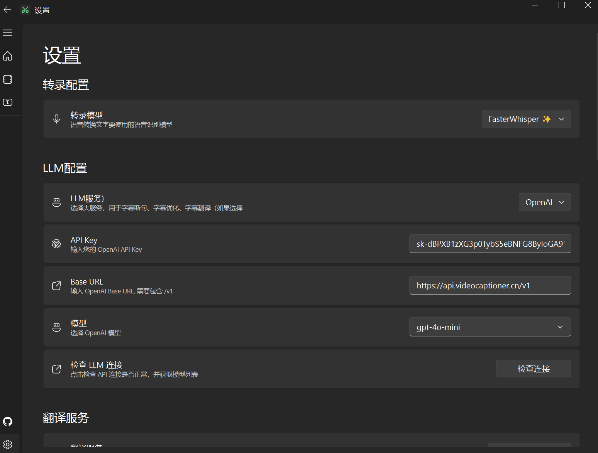

目前国内多家大模型厂商都提供了API接口，可以自行申请。也可以使用中转站，使用 OpenAI 或 Claude的API。

本教程以两种配置方式为例进行说明：

[SiliconFlow-API 配置](./llm_config.md#SiliconFlow-API-配置)

[中转站配置](./llm_config.md#中转站配置)

# SiliconFlow-API 配置

1. 申请大模型API

这里以国内的 [SiliconCloud](https://cloud.siliconflow.cn/i/onCHcaDx) 的 API 为例子，其已经集合国内多家大模型厂商。（注意以上是我的推广链接，通过此可以获得14元额度，介意就百度自行搜索注册，非广告）

注册后，在[设置](https://cloud.siliconflow.cn/account/ak)中获取API Key。

API 接口地址： https://api.siliconflow.cn/v1 （需要添加 /v1）

API Key： 将 SiliconCloud 平台的密钥粘贴到此处。

点击检查连接，“模型”设置栏会自动填充所有支持的模型名称。

选择需要的模型名称，推荐：deepseek-ai/DeepSeek-V3

> 2025 年 2 月 6 日起，未实名用户每日最多请求此模型 100 次

根据官方要求该模型需要实名才能获取更多的调用次数。不想实名可以考虑使用其他中转站。

`线程数 (Thread Count)`: SiliconCloud 并发有限，推荐只设置 5 个线程或以下。

# 中转站配置

1. 先在 [本项目的中转站](https://api.videocaptioner.cn/register?aff=UrLB) 注册账号
,通过此链接注册默认赠送 $0.4 测试余额。

2. 然后获取 API Key： [https://api.videocaptioner.cn/token](https://api.videocaptioner.cn/token)

3. 在软件设置中配置 API Key 和 API 接口地址, 如下图：

BaseURL: `https://api.videocaptioner.cn/v1`

API-key: `上面获取的API Key`

💡 模型选择建议 (本人在各质量层级中选出的高性价比模型)： 

 - 高质量之选： `claude-3-5-sonnet-20241022` (耗费比例：3) 

 - 较高质量之选： `gemini-2.0-flash`、`deepseek-chat` (耗费比例：1) 

 - 中质量之选： `gpt-4o-mini`、`gemini-1.5-flash` (耗费比例：0.15) 

`线程数 (Thread Count)`: 本站支持超高并发，软件中线程数直接拉满即可~ 处理速度非常快~

> PS: 条件差一点的可直接使用 `gpt-4o-mini`, 便宜且速度快。这个模型也花不了几个钱的，建议不要折腾本地部署了。

