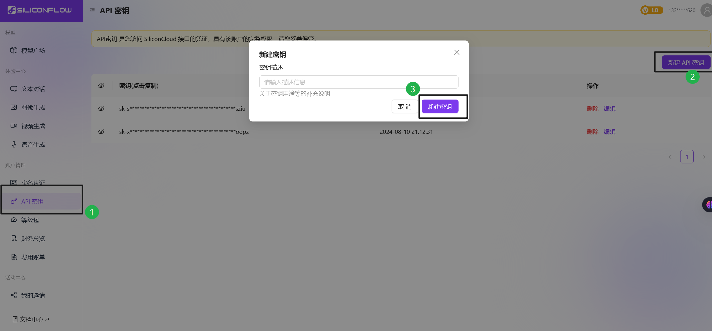
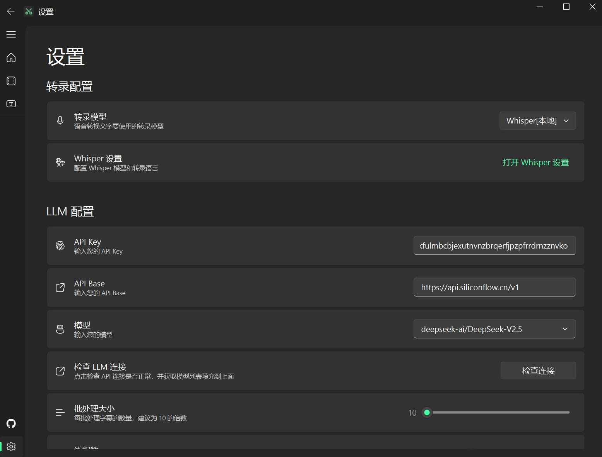

1. 申请大模型API
目前国内多家大模型厂商都提供了API接口，可以自行申请。
也可以使用中转站，使用 OpenAI 或 Claude的API。

这里以国内的 [SiliconCloud](https://cloud.siliconflow.cn/i/onCHcaDx) 的 API 为例子，其已经集合国内多家大模型厂商。（注意以上是我的推广链接，通过此可以获得14元额度，介意就百度自行搜索注册，非广告）

注册获取API Key 后，在设置中获取API Key。

API 接口地址： https://api.siliconflow.cn/v1 （需要添加 /v1）

API Key： 将 SiliconCloud 平台的密钥粘贴到此处。

点击检查连接，“模型”设置栏会自动填充所有支持的模型名称。

选择需要的模型名称，例如：deepseek-ai/DeepSeek-V2.5

还有两个重要参数需要配置:

1. 批处理大小 (Batch Size)

此参数决定每次向大模型发送的字幕条数。就像是一次性给大模型看多少句话:
- 数值越大,携带的上下文信息越丰富
- 但也会增加处理出错的风险

🔸 小模型推荐: 10条
🔸 大模型推荐: 20-30条

2. 线程数 (Thread Count)

控制同时处理字幕的线程数量。形象地说,这就像餐厅的厨师数量:
- 线程越多,处理速度越快
- 但要考虑服务商的并发限制

建议根据实际情况灵活设置,在服务商允许的范围内尽可能调高。

🔸 SiliconCloud API 推荐设置: 5个线程
