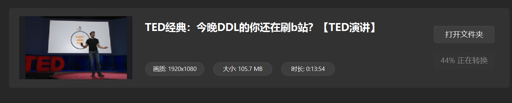
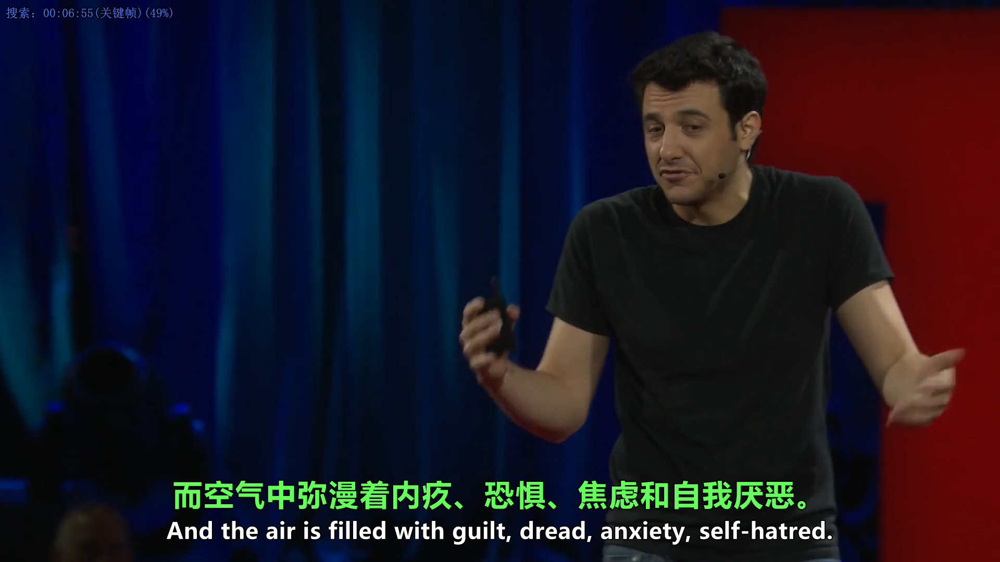
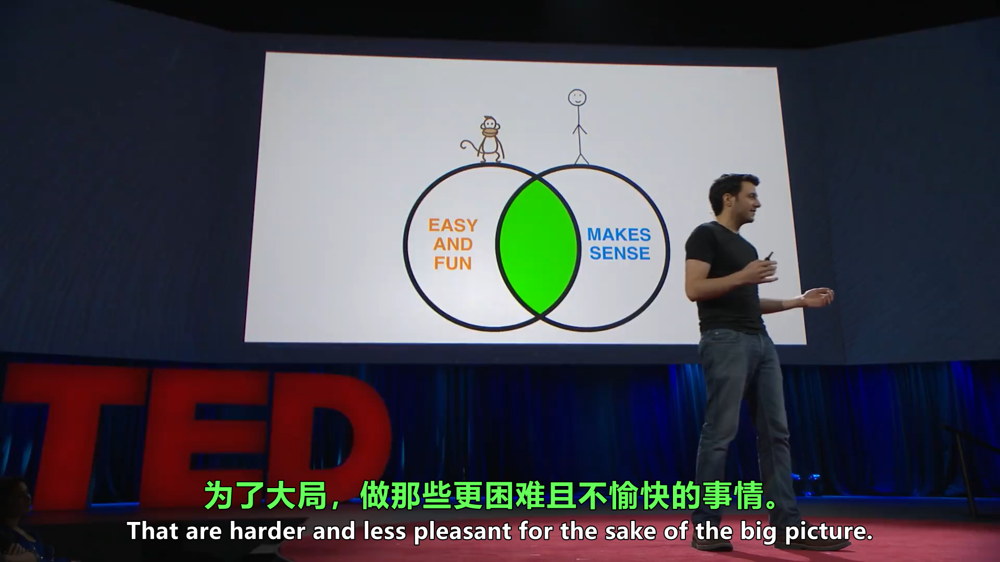
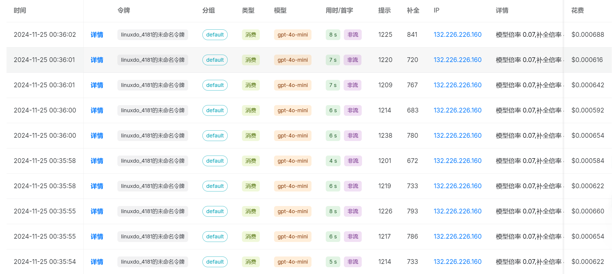

### 使用 Whisper 转录


### 转录成功以后的字幕
```
1
00:00:02,080 --> 00:00:08,600
So in college, I was a government major,

2
00:00:08,600 --> 00:00:11,080
which means I had to write a lot of papers.

3
00:00:11,080 --> 00:00:12,600
Now, when a normal student writes a paper,

4
00:00:12,600 --> 00:00:15,460
they might spread the work out a little like this.

5
00:00:15,460 --> 00:00:16,300
So you know.

6
00:00:16,300 --> 00:00:20,040
You get started maybe a little slowly,

7
00:00:20,040 --> 00:00:21,600
but you get enough done in the first week

8
00:00:21,600 --> 00:00:24,000
that with some heavier days later on,

9
00:00:24,000 --> 00:00:26,200
everything gets done and things stay civil.

10
00:00:26,200 --> 00:00:29,840
And I would wanna do that like that.

11
00:00:29,840 --> 00:00:30,840
That would be the plan.

12
00:00:30,840 --> 00:00:33,580
I would have it all ready to go,

13
00:00:33,580 --> 00:00:36,120
but then actually the paper would come along

14
00:00:36,120 --> 00:00:37,720
and then I would kinda do this.

15
00:00:40,480 --> 00:00:43,280
And that would happen to every single paper.

16
00:00:43,280 --> 00:00:47,240
But then came my 90 page senior thesis,

17
00:00:47,240 --> 00:00:49,580
a paper you're supposed to spend a year on.

18
00:00:49,580 --> 00:00:52,320
I knew for a paper like that, my normal workflow

19
00:00:52,320 --> 00:00:54,580
was not an option, it was way too big a project.

20
00:00:54,580 --> 00:00:56,580
So I planned things out and I decided

21
00:00:56,580 --> 00:00:59,520
I kinda had to go something like this.

```

### 进行断句与字幕的优化翻译
```
1
00:00:02,080 --> 00:00:08,597
所以在大学时，我是政府专业的学生
So in college, I was a government major.

2
00:00:08,600 --> 00:00:11,078
这意味着我得写很多论文
Which means I had to write a lot of papers.

3
00:00:11,080 --> 00:00:12,596
现在，普通学生写论文时
Now when a normal student writes a paper,

4
00:00:12,600 --> 00:00:15,460
他们可能会这样分散工作
They might spread the work out a little like this.

5
00:00:15,460 --> 00:00:20,040
所以你知道，你可能会稍微慢一些开始
So you know, you get started maybe a little slowly,

6
00:00:20,040 --> 00:00:21,593
但你在第一周能够完成足够的工作
But you get enough done in the first week.

7
00:00:21,600 --> 00:00:23,996
这样之后的一些繁忙日子
That with some heavier days later on.

8
00:00:24,000 --> 00:00:26,200
一切都能完成，事情保持得当
Everything gets done and things stay civil.

9
00:00:26,200 --> 00:00:29,840
我也希望那样去做
And I would wanna do that like that.

10
00:00:29,840 --> 00:00:31,936
那将是我的计划
That would be the plan I would have.

11
00:00:31,936 --> 00:00:35,059
一切都准备好了，但实际上论文却并没有完成
It was all ready to go, but then actually the paper

```

### 最终合成视频






### 查看日志
```
原字幕：So in college, I was a government major.
翻译后字幕：所以在大学时，我是一个政府专业的学生。
反思后字幕：所以在大学时，我是政府专业的学生。
===========
原字幕：Which means I had to write a lot of papers.
翻译后字幕：这意味着我必须写很多论文。
反思后字幕：这意味着我得写很多论文。
===========
原字幕：Now when a normal student writes a paper,
翻译后字幕：现在，当一个普通学生写论文时，
反思后字幕：现在，普通学生写论文时，
===========
原字幕：They might spread the work out a little like this.
翻译后字幕：他们可能会像这样分散工作。
反思后字幕：他们可能会这样分散工作。
===========
原字幕：So you know, you get started maybe a little slowly,
翻译后字幕：所以你知道，你可能会开始得有点慢，
反思后字幕：所以你知道，你可能会稍微慢一些开始，
===========
原字幕：But you get enough done in the first week,
翻译后字幕：但你在第一周能完成足够的工作，
反思后字幕：但你在第一周能够完成足够的工作，
===========
原字幕：That with some heavier days later on,
翻译后字幕：这样之后几天会比较忙，
反思后字幕：这样之后的一些繁忙日子，
===========
原字幕：Everything gets done and things stay civil.
翻译后字幕：所有事情都能完成，事情保持得体。
反思后字幕：一切都能完成，事情保持得当。
===========
原字幕：And I would wanna do that like that.
翻译后字幕：而我想要那样做。
反思后字幕：我也希望那样去做。
===========
原字幕：That would be the plan I would have.
翻译后字幕：那是我会有的计划。
反思后字幕：那将是我的计划。

```

### 查看大模型调用情况

本次字幕的优化翻译调用了大模型，进入服务商后台查看

调用花费的Tokens很少，消耗金额仅仅 ￥0.01 (OpenAI 官方价格计费，使用一些中转站的逆向模型花费更少)


